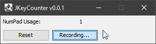

# JKeyCounter

Do you have a laptop with numpad?
Do you use it often?
For reasons outside of your control, are you getting a new laptop that does not have one against your will and you want to show how much you use/need/want that numpad?

This is not the solution to your problem, but it may help with the last point :)

JKeyCounter is a Java Swing application that runs on your computer, listen and counts all numpad's keystrokes _globally_, whether you are on a browser, word processor, or any application!

## How?

All you need to do is open JKeyCounter, hit the Start button and type away anywhere!


If you are thinking _Java does not allow this, how is it possible?_, the answer is through Java Native Interface and a _DLL_, so yes, it only works in Windows currently.

# Compiling

```bash
mvn clean install
```

This will create two outputs under folder _target_:

- **original-jKeyCounter-0.0.1.jar** with only this application without any of the dependencies
- **jKeyCounter-0.0.1.jar** as the _fat jar_ or _uber jar_ that can run standalone

# Running

Simply execute it with command-line as per below, or double-click the _fat jar_.

```bash
java -jar jKeyCounter-0.0.1.jar
```

# License

[MIT](https://choosealicense.com/licenses/mit/)
